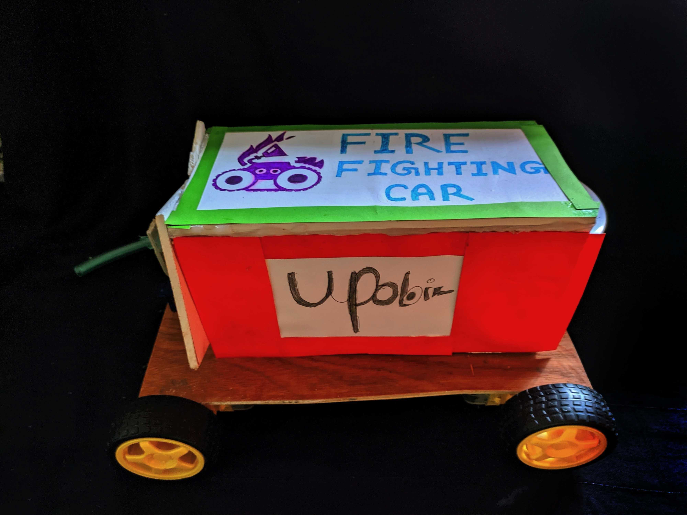
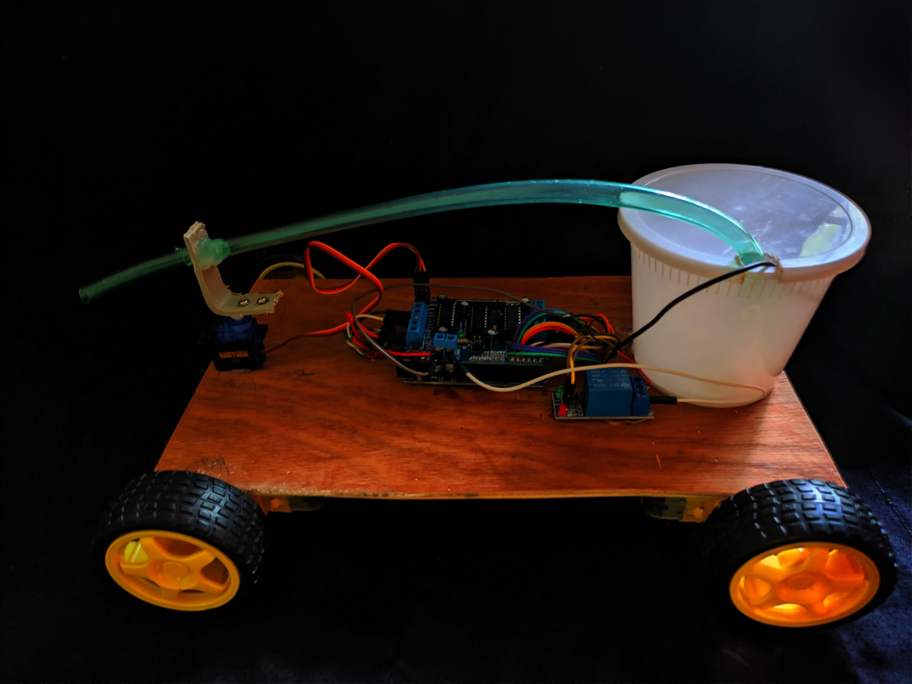

<h3 align="center" > Fire Fighting Robot </h1>

## Summary
Made a simple fire fighter robot project which independently detects and extinguishes fire.fire fighters are constantly at a risk of losing their life. Fire spreads rapidly if it is not controlled. In case of a gas leakage there even may be an explosion. So, in order to overcome this issue, this firefighting robotic system come to rescue which powered by Arduino Uno and Motor Shield Driver.it is also equipped with the fire flame sensor for detecting and approaching fire it also makes use of water tank and spray mechanism for extinguishing the fire.

## tools and modules 
* Arduino Uno R3
* Motor Driver Shield 
* Flame Sensor (3X)
* Relay Module (1Channel)
* Servo 
* 3X Battery Case
* 3.7V Battery (total 12V)
* Wheel 4X
* 5v Water Pump
* Wire Jumper 

## Detailed Project Picture 

  <b>project with case</b> 
     
   <b> without case</b> 
     

